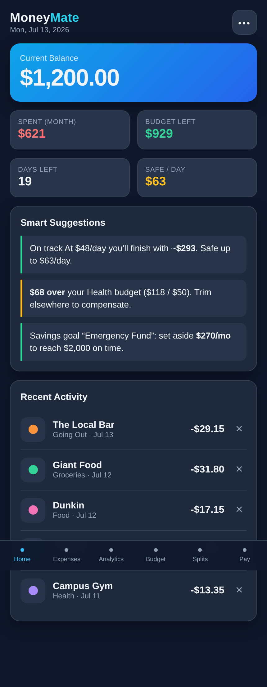
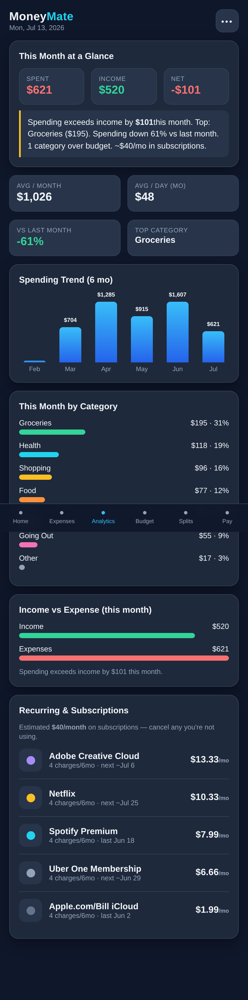
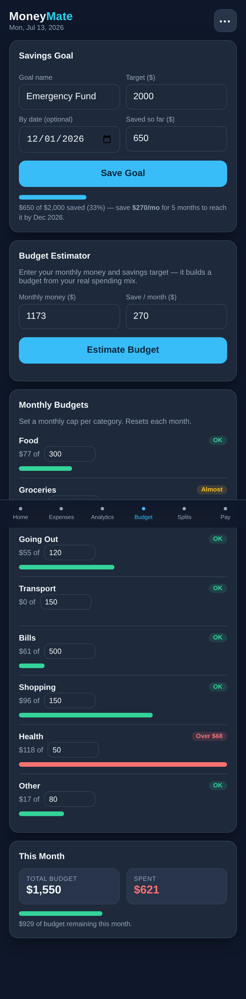
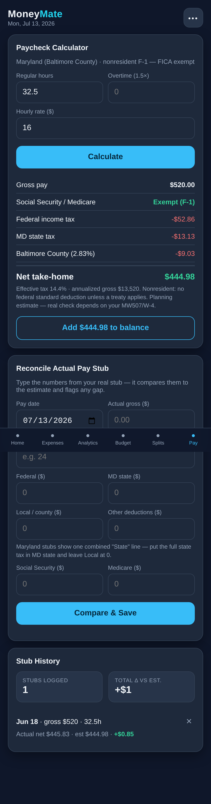
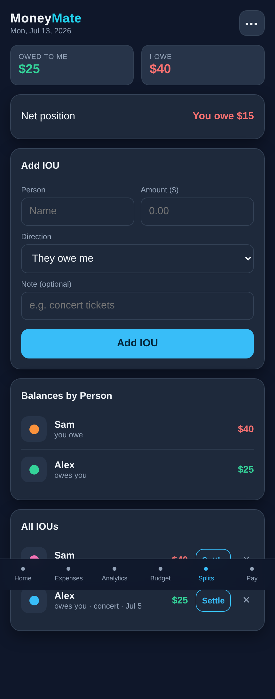
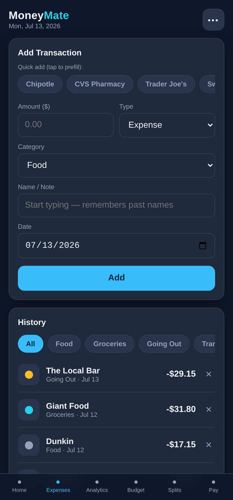

<h1 align="center">💸 MoneyMate</h1>

<p align="center">
  <b>A clean, mobile-first personal finance app — expense tracking, budgeting, savings goals, analytics, and a Maryland paycheck calculator — in a single self-contained HTML file.</b>
</p>

<p align="center">
  <a href="https://ayon0922.github.io/moneymate/"><b>🔗 Live Demo</b></a> &nbsp;•&nbsp;
  <a href="#-features">Features</a> &nbsp;•&nbsp;
  <a href="#-screenshots">Screenshots</a> &nbsp;•&nbsp;
  <a href="#-tech--architecture">Tech</a>
</p>

<p align="center">
  
  
  
  
</p>

---

## Overview

**MoneyMate** is a zero-dependency personal finance tracker I built to manage my own money as an international student — then hardened into a real product. It runs entirely in the browser from a single HTML file: no server, no database, no build step. Data lives in the browser's `localStorage`, so it works offline and installs to your phone's home screen like a native app.

What makes it more than a toy: it ingests **~1,500 real bank transactions** from a Chase CSV export, auto-categorizes them, detects recurring subscriptions, and includes a **Maryland payroll-tax engine** that correctly handles the **F-1 nonresident (FICA-exempt)** case — validated to the penny against real pay stubs.

> **Privacy:** this repository contains only the app code. No personal financial data is included. Everything you enter stays in your own browser.

---

## ✨ Features

**Money tracking**
- Real-time balance, income & expense logging across 8 categories
- Merchant memory — autocompletes names you've used and auto-fills their category
- Dedicated Cash/Transfer category so account transfers don't distort spending

**Budgeting & saving**
- Monthly budgets with color-coded progress bars
- **Savings goals** with target dates and "save $X/month to hit it" guidance
- **Budget Estimator** — a reverse budget: enter your income and savings target, and it allocates a per-category budget from your *actual* spending mix, then projects your future balance

**Insight**
- **Smart Suggestions** — projects your daily burn rate and warns before you overspend
- **Analytics** — monthly summary, 6-month trend, category breakdown, income-vs-expense
- **Recurring & Subscriptions** — auto-detects subscriptions (Netflix, Spotify, Apple, etc.) and estimates your total monthly subscription cost
- **Splits** — track who owes you and who you owe

**Paycheck tools**
- **Paycheck calculator** — hours → net pay using 2026 Maryland (Baltimore County) withholding, with **F-1 nonresident FICA-exemption** and tax-treaty support
- **Pay-stub reconciliation** — compare estimated vs. actual withholding and flag discrepancies (e.g. FICA wrongly withheld)

---

## 📸 Screenshots

| Dashboard | Analytics | Budget & Savings |
|:---:|:---:|:---:|
|  |  |  |

| Paycheck Calculator | Splits | Expenses |
|:---:|:---:|:---:|
|  |  |  |

<sub>Screenshots use demo data, not real financial information.</sub>

---

## 🛠 Tech & Architecture

- **Frontend:** Vanilla HTML / CSS / JavaScript — a single ~60 KB file, no frameworks, no dependencies
- **Persistence:** browser `localStorage` (client-side); JSON import/export for backup and cross-device transfer
- **Delivery:** static hosting on **GitHub Pages**, installable as a PWA-style app via "Add to Home Screen"
- **Offline-first:** all charts and logic are dependency-free, so it works with no network

**Notable engineering:**
- **Data pipeline** — a Python (`pdfplumber` / `csv`) pipeline parses bank statements and a Chase CSV, cleans and keyword-categorizes ~1,500 transactions, and reconciles the running balance exactly.
- **Tax engine** — an annualized percentage-method implementation of 2026 federal + Maryland state + Baltimore County withholding, including FICA, nonresident-alien rules, and treaty exemptions.
- **Subscription detection** — a heuristic that combines a known-brand dictionary with inter-charge interval regularity (mean/standard-deviation of gaps) to separate true monthly subscriptions from frequent one-off purchases.

---

## 🚀 Run it

**Use the hosted version:** [ayon0922.github.io/moneymate](https://ayon0922.github.io/moneymate/)

**Or run locally:**
```bash
git clone https://github.com/Ayon0922/moneymate.git
cd moneymate
open index.html      # or just double-click it
```

That's it — no install, no server.

---

## 🗺 Roadmap

- Optional backend (FastAPI + SQLite/Postgres) for cross-device sync
- Monthly auto-summary notifications
- CSV auto-import and multi-currency support

---

## 👤 Author

**Ayon Rahman** — CS student at UMBC, focused on data engineering & analytics.

Built as a personal project to solve a real problem, then engineered into a shippable app.
